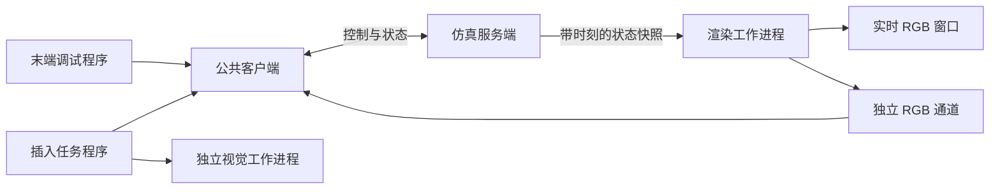

# 运行结构与接口

## 职责

`apps/server.py` 只启动仿真服务。运行模块位于 `src/ur5e_sim/`：

- `server/runtime.py`：单控制连接、协议分发、唯一物理状态修改线程。
- `control/kinematics.py`、`manual.py`、`trajectory.py`：坐标与 IK、手动控制、连续分段执行和碰撞保护。
- `client.py`：公共连接、状态、运动、同步 RGB 接口。无任务或算法逻辑。
- `tasks/insertion.py`：客户端完整任务、阶段限制、观测有效性及异常处理。
- `vision/aruco.py`、`pnp.py`：两条独立检测路线；`vision/detect.py` 是统一入口；`vision/core/` 是迁入的已有算法。原演示入口和冻结测试配置仅用于 `tests/fixtures/` 的算法回归。
- `camera/live.py`：快照渲染进程、RGB 窗口、独立二进制通道；`calibration.py` 和 `capture.py` 提供相机参数及成像工具。
- `scenes/`：可单独运行的生成器。基础 → 夹爪控制 → 相机 → 检测 → 插入的生成关系保留。



相机工作进程只设置快照并执行 `mj_forward`，从不调用 `mj_step`。预览队列容量为 1，过载丢弃旧帧。拍摄请求队列容量为 2，缓存最多 8 张已完成图像。关闭服务端时回收工作进程、窗口和连接。

## 公共 Python 接口

```python
from ur5e_sim.client import Client, set_preview

set_preview(8765, True)  # 不占用机器人控制连接
with Client(8765) as robot:
    state = robot.state()
    rgb, snapshot = robot.capture()
    # targets 是 T_WORLD_FROM_TCP 4×4 刚体矩阵列表；每次运动都经过服务端预检。
    robot.move(targets)
    robot.wait()
    robot.stop()
```

默认控制地址 `127.0.0.1:8765`，RGB 地址为控制端口加 1。控制协议使用带请求 ID 的 JSON 行，保留 `command`／`key` 通用调试接口，增加 `state`、`capture`、`motion`、`recover`、`stop` 等结构化操作。`inspect/align/insert/retract` 属于任务程序，服务端不解释这些业务命令。

只有一个运动控制连接。第二个连接不能接管；断连／心跳超时清空待执行动作并保持当前测量关节位置。预览使用独立通道。RGB 数据为长度前缀的 JSON 元数据和 RGB uint8 原始字节，不进入控制消息。

定位快照包括帧号、拍摄仿真时间、关节状态、内参、`T_WORLD_FROM_CAMERA_OPENCV`。视觉进程仅接收 RGB、内参和算法／几何配置。工具运动或停止使捕获凭据失效，服务端在使用检测结果对准前再次检查快照。

## 插入与恢复

默认已夹持 16×4×100 mm 插头，尖端位于 TCP 局部 +Z 80 mm。孔道 18×6×20 mm，孔前距离 30 mm，插入深度 10 mm，世界插入方向 +Y。

完整流程从 Home 开始，抬升 120 mm，然后到端口前上方 280 mm／40° 观察。端口坐标 X 右、Y 下、Z 向孔内；长度米，四元数 WXYZ：

```text
T_WORLD_FROM_PORT = T_WORLD_FROM_CAMERA_OPENCV @ T_CAMERA_FROM_PORT
T_WORLD_FROM_TCP = T_WORLD_FROM_PLUG_TIP @ inverse(T_TCP_FROM_PLUG_TIP)
```

插入／退出保持姿态，目标间距 ≤1 mm，速度由 `configs/insertion.json` 的 `insert_speed_m_s` 设置。配置加载和服务端执行共用 `control/limits.py` 的速度校验，当前上限 20 mm/s；当前任务配置为 15 mm/s，通用执行器未指定速度时仍默认 5 mm/s。任务记录保存本轮速度，验收按记录值检查实际轨迹速度。服务端逐点 IK、全路径预检，并在每段执行前根据测量状态复检。每段至少 320 个采样点，实际关节跟踪与速度收敛后才继续。

开始插入时，服务端保留测得的孔前位姿作为受保护路径的退出目标。中止或断线后保留该目标，拒绝普通移动，只允许显式 `recover` 重新检查直线退出路径。退出成功才解除保护。服务端重启将重置仿真，不恢复上次会话。

正常完整流程在退出后，经本轮保存的观察位姿、抬升位姿返回起始 Home。客户端仅在本轮退出完成、服务端已解除保护、动作代次及测量关节状态未改变时提出回程；服务端对整段回程重新求 IK 和碰撞预检，并检查实际执行接触。返回后验证 Home 关节位置与静止状态，才将任务记为成功。这样同一服务端可连续运行 ArUco、PnP。中止、退出失败或独立的 `--retract-only` 不自动触发完整回程。

## 边界

第一版仍是简化刚性预夹持、局部 IK 和离散碰撞预检，没有拾取、滑移、全局规划或力控。名义相机标定和理想渲染不能代表实机精度。深度／分割及工件真值仅用于评估，算法不读取它们。

普通检测场景保留历史主点编码；插入场景使用已修正的 MJCF 主点偏移。需要定位时使用插入场景。几何变化必须通过生成器重建；配置指纹用于拒绝新参数与旧插入模型的混用。
